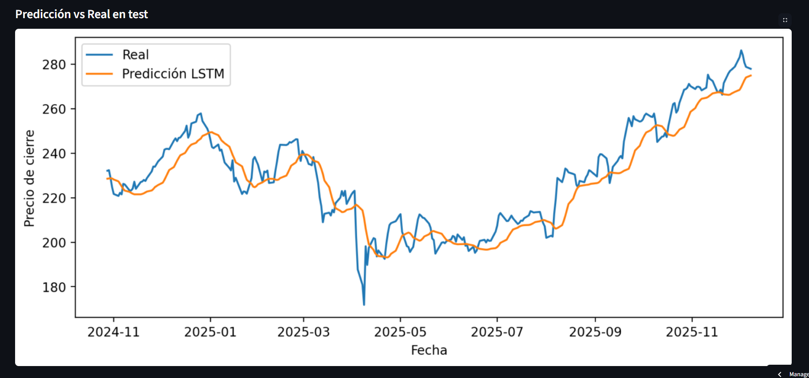

# 📈 Predicción del Precio de Cierre de Acciones con IA (LSTM)

## 🖼️ Vista General de la Aplicación

Aquí puedes ver una previsualización de la aplicación desplegada en Streamlit, incluyendo su interfaz principal y elementos más importantes.

  

  
  
  

📘 Proceso del Proyecto, Inspiración y Base Técnica

Este proyecto nació con el objetivo de crear un modelo de Inteligencia Artificial capaz de predecir el precio de cierre de una acción para el día actual, utilizando únicamente datos históricos hasta el día anterior.
A lo largo del proyecto, se desarrolló un flujo completo, desde la adquisición de datos, construcción del modelo, pruebas, interfaz gráfica y despliegue web.

El proceso completo fue desarrollado en conjunto entre el estudiante y el asistente de IA (ChatGPT), siguiendo una metodología incremental y experimental, donde cada etapa se validó y mejoró hasta obtener una aplicación funcional.

🧪 1. Inicio: inspiración y modelo base

El punto de partida fue un prototipo visto en Hugging Face Spaces, específicamente un modelo simple que toma 60 días de precios de cierre y predice el cierre del día siguiente mediante una red LSTM.

Este enfoque sirvió como inspiración porque es:

Fácil de entender

Rápido de entrenar

Muy práctico para series temporales financieras

Reprodu­cible con datos reales

Sin embargo, el proyecto avanzó mucho más allá de ese ejemplo básico.

🔧 2. Construcción del modelo LSTM desde cero

Durante el proceso de desarrollo, logramos:

✔ Reescribir el modelo completamente

Implementación 100% original en Python + TensorFlow

Preprocesamiento propio

División en conjuntos (train/test)

Creación de secuencias de entrada con ventana deslizante

Entrenamiento del modelo con reducción automática del learning rate

Eliminación del EarlyStopping para cumplir requerimientos del usuario

✔ Decisiones técnicas importantes

Entrenar SOLO con datos post-pandemia (2020)
→ el mercado cambió después de 2020; incluir datos viejos empeora la precisión.

Usar la ventana estándar de 60 días
→ recomendada para modelos de series temporales financieras.

Descargar datos hasta AYER, sin incluir valores intradía
→ esto fue un punto crítico: yfinance incluye valores de hoy si el mercado está abierto.
→ Se solucionó usando end=today.strftime("%Y-%m-%d"), ya que el parámetro es exclusivo.

Predicción del cierre del día actual (HOY) utilizando exclusivamente información pasada.

🚫 3. Problemas encontrados y cómo los resolvimos

Durante el desarrollo surgieron múltiples errores reales que fueron corregidos uno por uno.

❌ Modelo en Colab no entrenaba bien

Solución: usar GPU T4 → tiempos de entrenamiento adecuados y mayor estabilidad.

❌ Datos incorrectos por incluir valores intradía

Solución: limitar descarga a end=hoy, que entrega hasta ayer, no hasta hoy.

❌ Streamlit Cloud mostrando

Error: removeChild / Unexpected frontend error
Solución:

El archivo estaba completamente comentado por Colab

Se reescribió desde cero sin comentarios mágicos

Se renombró correctamente como streamlit_app.py

❌ Archivo requirements.txt no detectado

Solución:

Debe llamarse EXACTAMENTE requirements.txt

Se ajustó contenido compatible con Streamlit Cloud.

❌ Fallos de importación por nombres incorrectos

Solución:

Renombrar archivos Python con nombres estándar y sin acentos.

❌ Streamlit matando la app por exceso de entrenamiento

Solución:

Reducir número de épocas a 20–40

Mantener modelo funcional sin sobrecargar CPU.

🧩 4. Extensión del proyecto: CLI + App Web

El proyecto no se limitó al modelo.
También desarrollamos:

✔ CLI (Command Line Interface)

Permite ejecutar predicciones desde consola:

--python
python prediccion_precio_accion_IA.py --ticker AAPL

Esto lo convierte en un módulo automatizable para pipelines (MCP).

✔ Aplicación web Streamlit

Una interfaz interactiva que permite:

Elegir ticker

Entrenar el modelo

Ver predicción del cierre de hoy

Ver MAE/RMSE

Analizar gráficas

Todo sin necesidad de escribir código

La app fue desplegada en Streamlit Cloud, totalmente gratis.

🚀 5. Recomendaciones de uso
⚙️ Para entrenar el modelo:

Usar Google Colab con:

Acelerador de hardware: GPU

Tipo de GPU recomendado: T4

TensorFlow 2.15 (comprobado estable)

🌐 Para ejecutar la app:

Subir a Streamlit Cloud

Asegurar que requirements.txt y streamlit_app.py estén bien nombrados

Entrenar con pocas épocas en la nube (20–25)

🔍 6. Posibles errores y su explicación
| Problema                                  | Causa                           | Solución                               |
|-------------------------------------------|---------------------------------|-----------------------------------------|
| Predicción errónea                         | yfinance incluía datos de hoy   | Cambiar *end* para detener en AYER      |
| Streamlit muestra “removeChild error”      | Código comentado o fallido      | Reescribir archivo / revisar logs       |
| TensorFlow falla en CPU                    | Modelo muy grande               | Reducir épocas / usar GPU               |
| Requirements no cargan                     | Nombre incorrecto               | requirements.txt EXACTO                 |
| App se mata en la nube                     | Entrenamiento pesado            | Bajar épocas / simplificar modelo       |

🧠 7. Base teórica (resumen técnico)

El proyecto se fundamenta en principios de:

✔ Redes Neuronales LSTM

Especializadas en secuencias temporales, capaces de aprender patrones de corto y medio plazo.

✔ Series temporales financieras

El precio de cierre es un proceso ruidoso, pero presenta tendencias locales que LSTM puede capturar.

✔ Ventanas deslizantes

Se usa un conjunto fijo de los últimos 60 días para predecir el siguiente valor.

✔ Escalado MinMax

Mejora la estabilidad numérica en redes recurrentes.

✔ Evaluación con MAE / RMSE

Métricas estándar en predicción de regresión.

🎓 8. Resultado final aprendido y logrado

Después de iterar sobre el modelo, corregir errores, optimizar la lógica y construir interfaz:

✔ El modelo predice el cierre de HOY con buena precisión
✔ La app Streamlit funciona como herramienta real
✔ Está completamente documentado
✔ Se puede ejecutar gratis
✔ Es un proyecto profesional apto para portafolio o presentación académica

## 📌 Contenido del repositorio
